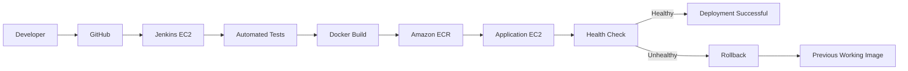

# End-to-End CI/CD Deployment on AWS

A hands-on DevOps project that implements an automated CI/CD pipeline using Jenkins, Docker, Amazon ECR, and AWS EC2.

The pipeline automatically detects changes pushed to GitHub, runs automated application tests, builds and versions a Docker image, pushes the image to Amazon ECR, deploys the new release to a separate EC2 application server, performs a runtime health check, and automatically restores the previous working image if the new deployment fails.

## Key Features

- Automated pipeline triggering from GitHub changes using Jenkins Poll SCM
- Automated Python testing with pytest before deployment
- Docker image creation and build-number versioning
- Docker image storage in Amazon ECR
- Automated deployment to a separate AWS EC2 application server
- Runtime application health checks
- Automatic rollback to the previous working Docker image after a failed deployment
- IAM roles for AWS access without storing AWS access keys in the pipeline
- Jenkins-managed SSH credentials for secure deployment access
## Architecture



The Jenkins server is responsible for CI/CD orchestration, while the application runs on a separate EC2 instance. Docker images are stored in Amazon ECR and identified using the Jenkins build number.
## CI/CD Pipeline Stages

### 1. Source Code Detection
Jenkins uses Poll SCM to detect new commits pushed to the GitHub repository and automatically starts the pipeline.

### 2. Automated Testing
A Python virtual environment is created and application tests are executed with pytest. If the tests fail, the pipeline stops before an image is built or deployed.

### 3. Docker Image Build
Jenkins builds a Docker image for the Flask application and tags it using the Jenkins build number.

### 4. Push to Amazon ECR
Jenkins authenticates to Amazon ECR using its EC2 IAM role, tags the image with the ECR repository address, and pushes the versioned image.

### 5. Deploy to Application EC2
Jenkins securely connects to the separate application EC2 instance using an SSH credential. The application server authenticates to ECR through its own read-only IAM role, pulls the new image, and starts the application container.

### 6. Health Check
After deployment, Jenkins checks the application's `/health` endpoint. A healthy response confirms the release.

### 7. Automatic Rollback
Before replacing the application, the pipeline records the currently running Docker image. If the new deployment fails its runtime health check, the failed container is removed and the previous working image is automatically restored.
## Technology Stack

| Category | Technology |
|---|---|
| Source Control | Git, GitHub |
| CI/CD | Jenkins |
| Application | Python, Flask |
| Testing | pytest |
| Containerization | Docker |
| Container Registry | Amazon ECR |
| Cloud Infrastructure | AWS EC2 |
| AWS Security | IAM Roles, Security Groups |
| Deployment Access | SSH |
| Pipeline Definition | Jenkins Declarative Pipeline |
| Operating System | Ubuntu Linux |
## Project Structure

```text
end-to-end-cicd-deployment/
├── app/
│   ├── __init__.py
│   └── app.py
├── tests/
│   └── test_app.py
├── scripts/
├── Dockerfile
├── Jenkinsfile
├── requirements.txt
├── .dockerignore
├── .gitignore
└── README
```
## Failure Handling and Rollback Testing

The pipeline was tested against two different failure scenarios.

### CI Test Failure

An intentionally unhealthy application response was introduced during testing. The pytest suite detected the failure and stopped the pipeline before the Docker image could be deployed.

This verifies that application failures can be caught early in the CI stage.

### Deployment Health-Check Failure

A controlled runtime deployment failure was introduced after the automated tests had passed.

The pipeline:

1. Built and pushed the new Docker image to Amazon ECR.
2. Saved the currently running application image.
3. Deployed the new image to the application EC2 instance.
4. Detected that the new deployment failed its runtime health check.
5. Removed the failed container.
6. Automatically restarted the previous working image.
7. Verified that the restored application returned a healthy response.

The failed release remained marked as a failed Jenkins build even though the previous healthy application was successfully restored.
## Security Considerations

- AWS access keys are not stored in the Jenkinsfile or source repository.
- The Jenkins EC2 instance uses an IAM role for access to Amazon ECR.
- The application EC2 instance uses a separate read-only IAM role to pull images from Amazon ECR.
- SSH private keys are managed through Jenkins Credentials rather than stored in GitHub.
- SSH access to the application server is restricted using AWS Security Groups.
- Application deployment and CI/CD orchestration run on separate EC2 instances.

## What I Learned

This project provided hands-on experience with building and troubleshooting a complete CI/CD workflow rather than configuring individual DevOps tools in isolation.

Key learning areas included:

- Designing a multi-stage Jenkins pipeline
- Integrating GitHub, Jenkins, Docker, Amazon ECR, and EC2
- Using IAM roles instead of static AWS credentials
- Managing SSH credentials securely in Jenkins
- Debugging SSH private-key format and authentication issues
- Preventing failed application code from reaching deployment
- Implementing runtime health checks
- Designing and testing automatic rollback
- Separating the Jenkins server from the application deployment server
- Automating pipeline execution when source code changes
